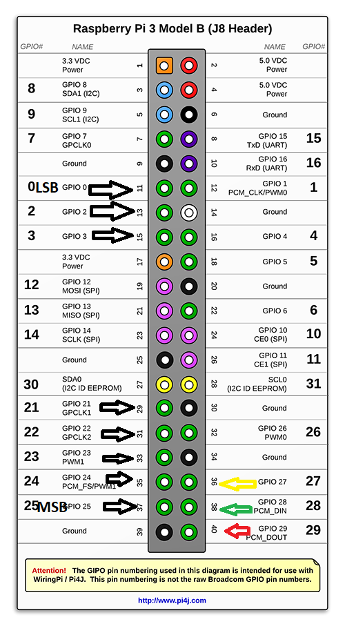

# Dad_Pi_Project

## Transmission protocol
|State Num|Send Ready|Ack|Description|
|---------|:--------:|:-:|-----------|
|1        |False    |False    |Starting state. Raspberry pi is calculating outputs.|
|2        |True     |False    |Raspberry Pi has values in gpio pins and awaits Ack from circuit|
|3        |True     |True     |Raspberry Pi collects next frame of information from accelerometer and will dissable Send Ready after collection|
|4        |False    |True     |Raspberry Pi is calculating outputs and awaits Ack to be False.|

## Raspberry Pi 3B Pinnout

BIT1 = 11  
BIT2 = 13  
BIT3 = 15  
  
BIT4 = 29  
BIT5 = 31  
BIT6 = 33  
BIT7 = 35  
BIT8 = 37  

ACK_IN (Yellow) = 36  
SEND_READY (Green) = 38  
OFFPIN (Red) = 40  